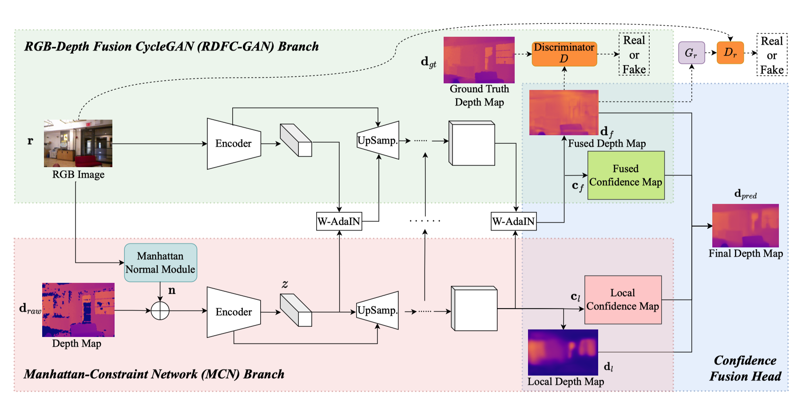

## RDFC-GAN: RGB-Depth Fusion CycleGAN for Indoor Depth Completion

This repository provides the code for our paper, **RDFC-GAN: RGB-Depth Fusion CycleGAN for Indoor Depth Completion** in TPAMI and its previous version **RGB-Depth Fusion GAN for Indoor Depth Completion** (RDF-GAN) in CVPR 2022.

----
RDFC-GAN: RGB-Depth Fusion CycleGAN for Indoor Depth Completion 
[[arXiv]](https://arxiv.org/abs/2306.03584) [[IEEE DL]](https://ieeexplore.ieee.org/document/10497905)

_IEEE Transactions on Pattern Analysis and Machine Intelligence 2024_

**Authors**: Haowen Wang\*, Zhengping Che\*, Yufan Yang, Mingyuan Wang, Zhiyuan Xu, Xiuquan Qiao, Mengshi Qi, Feifei Feng, and Jian Tang  _(\*equal contributions)_

----
RGB-Depth Fusion GAN for Indoor Depth Completion
[[arXiv]](https://arxiv.org/abs/2203.10856)

_Proceedings of the 35th IEEE/CVF Conference on Computer Vision and Pattern Recognition (CVPR), 2022_

**Authors**: Haowen Wang, Mingyuan Wang, Zhengping Che, Zhiyuan Xu, Xiuquan Qiao, Mengshi Qi, Feifei Feng, and Jian Tang

### Introduction

We design a two-branch end-to-end GAN-based fusion network, which takes a pair of RGB and incomplete depth images as input to predict a dense and completed depth map.


### Citation

If you find our work helpful in your research, please consider citing:

- RDFC-GAN
```
@ARTICLE{refcgan10497905,
  author={Wang, Haowen and Che, Zhengping and Yang, Yufan and Wang, Mingyuan and Xu, Zhiyuan and Qiao, Xiuquan and Qi, Mengshi and Feng, Feifei and Tang, Jian},
  journal={IEEE Transactions on Pattern Analysis and Machine Intelligence}, 
  title={RDFC-GAN: RGB-Depth Fusion CycleGAN for Indoor Depth Completion}, 
  year={2024},
  volume={},
  number={},
  pages={1-14},
  keywords={Depth completion;Generative adversarial network;RGB-depth fusion;Indoor environment},
  doi={10.1109/TPAMI.2024.3388004}}
```
- RDF-GAN
```
@inproceedings{wang2022rgb,
  title={Rgb-depth fusion gan for indoor depth completion},
  author={Wang, Haowen and Wang, Mingyuan and Che, Zhengping and Xu, Zhiyuan and Qiao, Xiuquan and Qi, Mengshi and Feng, Feifei and Tang, Jian},
  booktitle={Proceedings of the IEEE/CVF Conference on Computer Vision and Pattern Recognition},
  pages={6209--6218},
  year={2022}
}
```

### Environment Dependencies

We recommend using a conda environment:

```bash
conda create -n RDFC_GAN python=3.8  
conda activate RDFC_GAN

# pytorch installation
conda install pytorch==1.6.0 torchvision==0.7.0 cudatoolkit=10.2 -c pytorch

# DCN installation
cd lib/models/generator/rdf_generator/nlspn/deformconv
python setup.py build install
cd PATH_TO_RDF-GAN-V2

# other dependencies
cd ..
pip install -r requirements.txt
```


### Datasets

[**NYUv2 (official)**](https://cs.nyu.edu/~silberman/datasets/nyu_depth_v2.html): We used preprocessed NYUv2 HDF5 dataset provided by [Fangchang Ma](https://github.com/fangchangma/sparse-to-dense). 

[**SUN RGB-D (official)**](https://cs.nyu.edu/~silberman/datasets/nyu_depth_v2.html): For the overall prepare process, please refer to the [README](https://github.com/open-mmlab/mmdetection3d/blob/1.0/data/sunrgbd/README.md) page for SUN RGB-D.


### Training & Testing

You can adjust your own configuration in **config.py**, such as batch size, work directory, semantic label setting, etc. Alternatively, you can directly change these settings from the command line or shell script.

#### RDFC-GAN Training

To train on the NYUv2 dataset with default settings:

```bash
bash train.sh
```

#### RDFC-GAN Testing

To test on the NYUv2 dataset with default settings:

```bash
bash test.sh
```

#### RDF-GAN Testing

  ```bash
  bash RDF-GAN/bash/'***'.sh --load_from 'your chekpoint'
  ```

### Dependencies

This project uses the following third-party code:

- [**Surface Normal Estimation (SNE)**](https://github.com/baegwangbin/surface_normal_uncertainty): Used for surface normal estimation. This code is licensed under the [MIT License](https://github.com/baegwangbin/surface_normal_uncertainty/blob/main/LICENSE).


### License
This project is licensed under the [Apache License 2.0](LICENSE).

